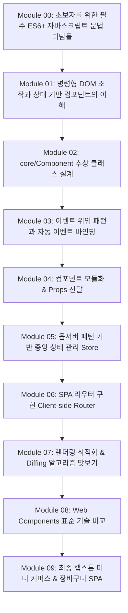

# 🚀 바닐라 자바스크립트 컴포넌트 딥다이브 커리큘럼

React, Vue 등 현대 프론트엔드 프레임워크의 근간이 되는 **상태 기반 컴포넌트 아키텍처(State-driven Component Architecture)**를 바닐라 자바스크립트로 직접 설계하고 구현하며 원리를 완벽히 체득하는 과정입니다. 초보자도 차근차근 따라올 수 있도록 **Step 00(필수 ES6+ 문법 디딤돌)**부터 8개 학습 단계로 구성되어 있습니다.

---

## 🎯 학습 목표

1. **명령형(Imperative) DOM 조작**에서 **선언적(Declarative) 상태 기반 렌더링**으로의 패러다임 전환
2. 객체지향 및 함수형 패러다임을 활용한 **컴포넌트 추상 클래스(`Component`)** 설계
3. **이벤트 위임(Event Delegation)** 패턴을 통한 효율적인 메모리 관리 및 동적 요소 이벤트 처리
4. **부모-자식 컴포넌트 간 단방향 데이터 흐름(Props & Custom Events)** 구축
5. **옵저버 패턴(Observer Pattern)** 기반의 리액티브 중앙 상태 관리(`Store`) 구현
6. 클라이언트 사이드 루팅(SPA Router) 및 간단한 렌더링 최적화(Diffing / Debounce) 체득

---

## 🗺️ 전체 학습 로드맵 Overview

---

## 📘 모듈별 세부 학습 과제

### 🐣 Module 00: 초보자를 위한 필수 ES6+ 자바스크립트 문법 디딤돌
- **개념 학습**
  - `import / export` ES6 모듈 시스템
  - `class`, `constructor`, `extends` 객체지향 기초
  - 구조 분해 할당(`Destructuring`)과 전개 연산자(`Spread Operator: ...`)를 통한 불변성 유지
  - 템플릿 리터럴(`` `${...}` ``)과 Array `map` 연산을 활용한 HTML 생성
  - 화살표 함수와 `this` 스코프 바인딩
- **실습 과제**: `steps/step-00-js-prerequisites/` 내 예제 실행

---

### 🔹 Module 01: 명령형 DOM 조작과 상태 기반 컴포넌트의 이해
- **개념 학습**
  - 기존 HTML/DOM 직접 조작(`document.querySelector`, `innerHTML`, `appendChild`)의 문제점 (상태 파편화, 스파게티 코드)
  - UI = f(state) : 상태(State)를 중심으로 UI가 결정되는 선언적 프로그래밍 패러다임
- **실습 과제**
  - 카운터 앱을 명령형 방식과 상태 중심 방식으로 각각 비교 작성

---

### 🔹 Module 02: core/Component 추상 클래스 설계
- **개념 학습**
  - 클래스(Class)와 상속(Inheritance)을 활용한 공통 컴포넌트 라이프사이클 규격화
  - `setup()` -> `template()` -> `render()` -> `setEvent()` -> `mounted()` 순서의 실행 흐름
  - `setState()` 호출 시 렌더링 파이프라인 자동화
- **실습 과제**
  - `src/core/Component.js` 파일 작성 및 카운터 컴포넌트 구동

---

### 🔹 Module 03: 이벤트 위임 패턴 (Event Delegation)
- **개념 학습**
  - DOM 이벤트 버블링(Bubbling)과 캡처링(Capturing)
  - re-render 시마다 이벤트를 재등록해야 하는 문제 및 메모리 누수 방지
  - 부모 타겟 요소에 이벤트를 한 번만 바인딩하는 `addEvent` 헬퍼 메서드 설계
- **실습 과제**
  - `addEvent` 헬퍼 구현 및 동적 리스트 TodoApp 이벤트 처리

---

### 🔹 Module 04: 컴포넌트 모듈화 및 부모-자식 관계 (Props & Events)
- **개념 학습**
  - 단일 책임 원칙(SRP)에 따라 자식 컴포넌트로 분리
  - 단방향 데이터 흐름: 부모 -> 자식 `props` 전달, 자식 -> 부모 콜백 호출
- **실습 과제**
  - `App.js` -> `ItemInput.js`, `ItemList.js`, `ItemFilter.js` 자식 컴포넌트 마운트

---

### 🔹 Module 05: 옵저버 패턴 기반 중앙 상태 관리 (Store)
- **개념 학습**
  - Props Drilling 문제 해결
  - Pub/Sub 및 옵저버 패턴 (Proxy 활용)
- **실습 과제**
  - `Store.js` 및 `observer.js` 구현 및 중앙 상태 연동

---

### 🔹 Module 06: SPA 라우터 구현 (Client-side Routing)
- **개념 학습**
  - History API & HashChange 이벤트
- **실습 과제**
  - `Router.js` 구현 및 동적 페이지 전환

---

### 🔹 Module 07: 렌더링 최적화 (Microtask & Diffing)
- **개념 학습**
  - `requestAnimationFrame` 배치 처리 및 DOM Diffing 노드 교체
- **실습 과제**
  - 연속 `setState` 100회 중복 방지 및 최소 DOM 갱신

---

### 🔹 Module 08: Web Components (Custom Elements, Shadow DOM) 비교
- **개념 학습**
  - 브라우저 네이티브 기술 웹 컴포넌트와 직접 만든 클래스 비교
- **실습 과제**
  - `customElements.define` 기반 `<my-counter>` 작성

---

### 🏆 Module 09: 최종 캡스톤 미니 커머스 & 장바구니 SPA 프로젝트
- **개념 학습**
  - Component 라이프사이클, 이벤트 위임, Store, Router, LocalStorage 동기화 종합 융합
- **실습 과제**: `steps/step-09-final-project/` 쇼핑몰 웹앱 완성과제

---

## 📋 진행 상황 체크리스트 (Progress Checklist)

- [ ] **Module 00**: 필수 ES6+ 자바스크립트 문법 디딤돌
- [ ] **Module 01**: 명령형 vs 선언적 상태 기반 UI 개념 이해 및 비교
- [ ] **Module 02**: `core/Component.js` 추상 클래스 설계 및 기본 카운터 구현
- [ ] **Module 03**: `addEvent` 이벤트 위임 메서드 구현 및 동적 요소 처리
- [ ] **Module 04**: Todo 앱 컴포넌트 분화 (`App`, `Input`, `List`, `Filter`) & Props 전달
- [ ] **Module 05**: `core/Store.js` 옵저버 패턴 구현 및 중앙 상태 관리 적용
- [ ] **Module 06**: `core/Router.js` History API 기반 라우터 구현
- [ ] **Module 07**: 비동기 렌더링 큐 및 DOM Diffing 최적화
- [ ] **Module 08**: Web Components 표준 기술 실습 및 비교 학습
- [ ] **Module 09**: 최종 캡스톤 미니 커머스 & 장바구니 SPA 프로젝트 완주
